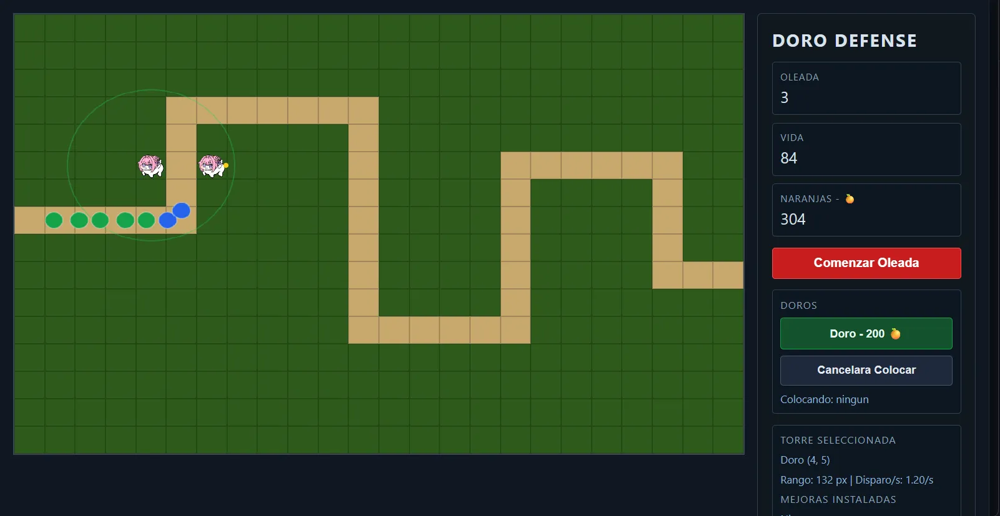
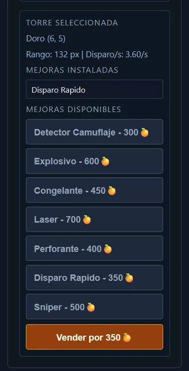

# Doro Defense 🍊

Un tower defense en Java

---

## Screenshots

| Gameplay | Panel de Mejoras |
|----------|--------------|
|  |  |

---

## Patrones

### Decorator Pattern

El sistema de mejoras está construido completamente alrededor del patrón **Decorator**. Cada torre comienza como una `BaseTower`, y cada mejora la envuelve en un nuevo decorador que sobreescribe sus estadisticas, delegando todo lo demás hacia abajo en la cadena.

```
BaseTower
  └── RapidFireDecorator   (fireRate × 3)
        └── SniperDecorator    (range × 2.5, fireRate × 0.75)
              └── LaserDecorator   (projectile = laser, canTargetLead = true)
```

Todos los decoradores extienden `TowerDecorator`, que implementa la interfaz `Tower` y redirige cada método a `wrapped` por defecto. Un decorador concreto sobreescribe únicamente los atributos que modifica:

| Decorador | cambia |
|---|---|
| `RapidFireDecorator` | `getFireRate()` × 3 |
| `SniperDecorator` | `getRange()` × 2.5, `getFireRate()` × 0.75 |
| `LaserDecorator` | proyectil - laser, `canTargetLead()` = true |
| `ExplosiveDecorator` | proyectil - bomba, `getDamage()` + 1 |
| `FreezingDecorator` | proyectil - congelación, `getPierce()` + 2 |
| `PiercingDecorator` | `getPierce()` + 3 (apilable) |
| `CamoDetectorDecorator` | `canTargetCamo()` = true, otorga visión de camuflaje en aura a torres cercanas |
Un detalle clave: `BaseTower.onTick` siempre recibe `self` — el decorador más **externo** — por lo que el targeting y la generación de proyectiles siempre reflejan las estadísticas completamente compuestas, no solo los valores base.
`UpgradeRegistry` actúa como catálogo: mapea claves de mejora a funciones de fábrica, costos y etiquetas, y gestiona el re-envoltorio cuando se inserta una nueva mejora en el medio de una pila de decoradores existente.

---

### Patrón Singleton

`GameState` es un singleton (`GameState.getInstance()`) que almacena todos los datos mutables del juego: enemigos, torres, proyectiles, monedas, vidas y número de oleada.

---

### Observer / Server-Sent Events

El frontend se conecta a `/events` y recibe el `GameState` serializado completo como mensaje SSE en JSON después de cada tick.

---

## Ejecutar

```bash
mvn package
java -jar target/tower-defense.jar
# open http://localhost:8080
```